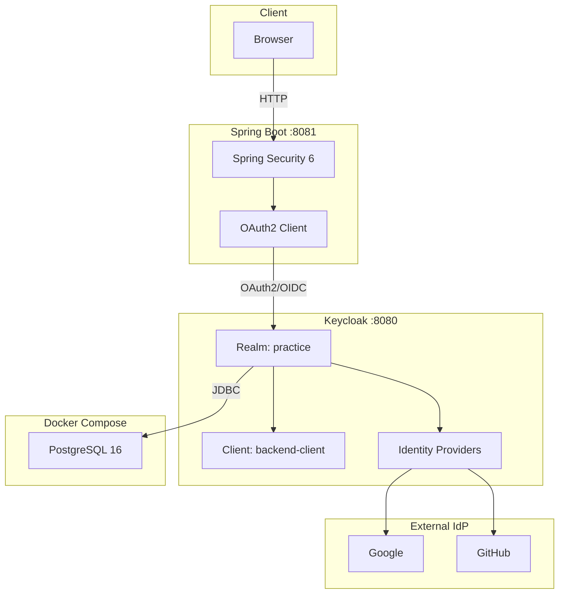

# Keycloak Practice

> 이 프로젝트는 [claude-devex](https://github.com/idean3885/claude-devex) 이슈 사이클 워크플로우를 사용합니다.

Keycloak 기반 SSO 및 OAuth2 연동 실습 프로젝트

## 프로젝트 소개

Keycloak을 Identity Provider로 활용하여 Google/GitHub SSO 연동과 Spring Boot OAuth2 클라이언트 통합을 학습합니다.

### 아키텍처



### 학습 목표

| 단계 | 내용 | 핵심 학습 포인트 | 문서 |
|------|------|------------------|------|
| 1 | Keycloak 실행 | Docker Compose, Realm/Client 설정 | [keycloak/](./keycloak/) |
| 2 | Google SSO 연동 | OAuth2 Identity Provider 설정, Redirect URI | [sso/](./sso/) |
| 3 | GitHub SSO 연동 | OAuth App 설정, Broker 인증 플로우 | [sso/](./sso/) |
| 4 | Spring Boot 연동 | Spring Security OAuth2 Client, OIDC 인증 | [backend/](./backend/) |

## 기술 스택

| 구분 | 기술 | 버전 | 용도 |
|------|------|------|------|
| Identity Provider | Keycloak | latest | SSO, 사용자 관리, IdP 브로커 |
| Backend | Spring Boot | 3.x | OAuth2 Resource Owner |
| Security | Spring Security | 6.x | OAuth2 Client, OIDC 인증 |
| Language | Java | 17+ (LTS) | 백엔드 구현 |
| Database | PostgreSQL | 16 | Keycloak 영속 저장소 |
| Infra | Docker Compose | - | 로컬 개발 환경 |

## 프로젝트 구조

```
keycloak-practice/
├── README.md                 # 프로젝트 개요 (이 파일)
├── CLAUDE.md                 # AI 협업 가이드
├── .coderabbit.yaml          # PR 자동 리뷰 설정
├── docker-compose.yml        # Keycloak + PostgreSQL
├── keycloak/                 # Keycloak 서버 설정 가이드
│   └── README.md
├── sso/                      # SSO 연동 가이드 (Google, GitHub)
│   └── README.md
├── backend/                  # Spring Boot OAuth2 연동
│   ├── README.md
│   └── src/
└── .claude/                  # AI 협업 설정
    └── skills/               # 워크플로우 스킬 (/spec, /implement, /commit 등)
```

## 빠른 시작

```bash
# 1. Keycloak + PostgreSQL 실행
docker-compose up -d

# 2. 관리자 콘솔 접속
open http://localhost:8080/admin  # admin / admin

# 3. Realm 생성: practice
# 4. Client 생성: backend-client (상세: keycloak/README.md)

# 5. Spring Boot 실행 (backend/ 디렉토리)
export KEYCLOAK_CLIENT_SECRET=<client secret>
./mvnw spring-boot:run

# 6. 테스트
open http://localhost:8081
```

## 개발 방식

**AI-Native Development (Spec-Driven Workflow)**

Claude Code와 마크다운 명세 기반으로 협업하는 개발 방식을 적용합니다.

```
Issue → Spec → Implement → Commit → PR
```

- GitHub 이슈로 작업 단위를 정의하고, 마크다운 명세를 작성한 뒤 코드를 구현
- 모든 설계 문서와 다이어그램은 Mermaid/PlantUML로 코드와 함께 버전 관리
- 워크플로우: `/github-issue` → `/spec` → `/implement` → `/commit` → `/github-pr`

> 워크플로우 상세: [.claude/README.md](./.claude/README.md) | AI 협업 가이드: [CLAUDE.md](./CLAUDE.md)

## PR 자동 리뷰

PR 생성 시 [CodeRabbit](https://coderabbit.ai)을 통해 자동 코드 리뷰가 수행됩니다.

```
PR 생성 → CodeRabbit 분석 → 리뷰 코멘트 자동 작성
```

- AI 기반 diff 분석 후 피드백 제공
- 버그, 보안, 성능, 컨벤션 등 검토
- 설정: `.coderabbit.yaml` (프로젝트 루트)

> 상세: [.github/README.md](./.github/README.md) | [CodeRabbit 공식 문서](https://docs.coderabbit.ai)

## 참고

- [Keycloak Docs](https://www.keycloak.org/documentation)
- [Spring Security OAuth2](https://docs.spring.io/spring-security/reference/servlet/oauth2/index.html)
- [CodeRabbit Docs](https://docs.coderabbit.ai)
