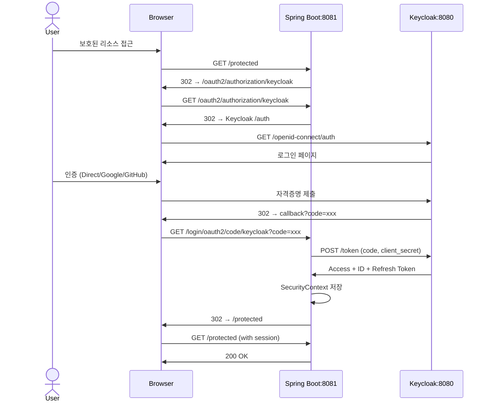

# Backend OAuth2 연동

Spring Boot 3 + Spring Security 6 기반 Keycloak 연동

## 플로우



## 기술 스택

| 구분 | 버전 |
|------|------|
| Java | 17+ (LTS) |
| Spring Boot | 3.x |
| Spring Security | 6.x |

## 의존성

```xml
<dependency>
    <groupId>org.springframework.boot</groupId>
    <artifactId>spring-boot-starter-oauth2-client</artifactId>
</dependency>
<dependency>
    <groupId>org.springframework.boot</groupId>
    <artifactId>spring-boot-starter-security</artifactId>
</dependency>
```

## 설정

### application.yml

```yaml
spring:
  security:
    oauth2:
      client:
        registration:
          keycloak:
            client-id: backend-client
            client-secret: ${KEYCLOAK_CLIENT_SECRET}
            scope: openid, profile, email
        provider:
          keycloak:
            issuer-uri: http://localhost:8080/realms/practice

server:
  port: 8081
```

## SecurityConfig

```java
@Configuration
@EnableWebSecurity
public class SecurityConfig {

    @Bean
    public SecurityFilterChain filterChain(HttpSecurity http) throws Exception {
        return http
            .authorizeHttpRequests(auth -> auth
                .requestMatchers("/", "/public/**").permitAll()
                .anyRequest().authenticated()
            )
            .oauth2Login(Customizer.withDefaults())
            .build();
    }
}
```

## 실행

```bash
# Client Secret 환경변수 설정
export KEYCLOAK_CLIENT_SECRET=<keycloak에서 복사한 값>

# 실행
./mvnw spring-boot:run
```

## 테스트

1. http://localhost:8081 접속
2. Keycloak 로그인 페이지로 리다이렉트
3. Google/GitHub 또는 직접 로그인
4. 인증 완료 후 애플리케이션으로 복귀
