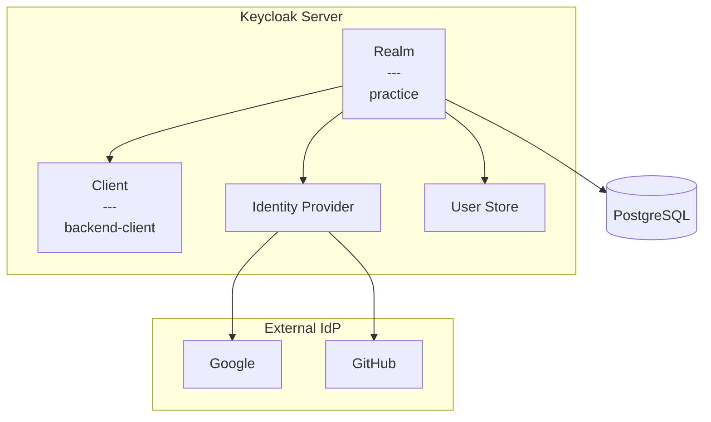

# Keycloak 설정

## 구조



## 사전 요구사항

- Docker & Docker Compose
- 포트: 8080 (Keycloak), 5432 (PostgreSQL)

## 실행

```bash
# 루트에서 실행
docker-compose up -d

# 로그 확인
docker-compose logs -f keycloak
```

## 관리자 콘솔

- URL: http://localhost:8080/admin
- ID: `admin` / PW: `admin`

## Realm 생성

1. 좌측 상단 드롭다운 → `Create Realm`
2. Realm name: `practice`

## Client 생성

| 항목 | 값 |
|------|-----|
| Client ID | `backend-client` |
| Client Protocol | `openid-connect` |
| Root URL | `http://localhost:8081` |
| Client authentication | `ON` |
| Valid redirect URIs | `http://localhost:8081/*` |
| Web origins | `http://localhost:8081` |

## Client Secret

Clients → `backend-client` → Credentials → `Client secret` 복사

## 종료

```bash
docker-compose down      # 중지
docker-compose down -v   # 볼륨 포함 삭제
```
