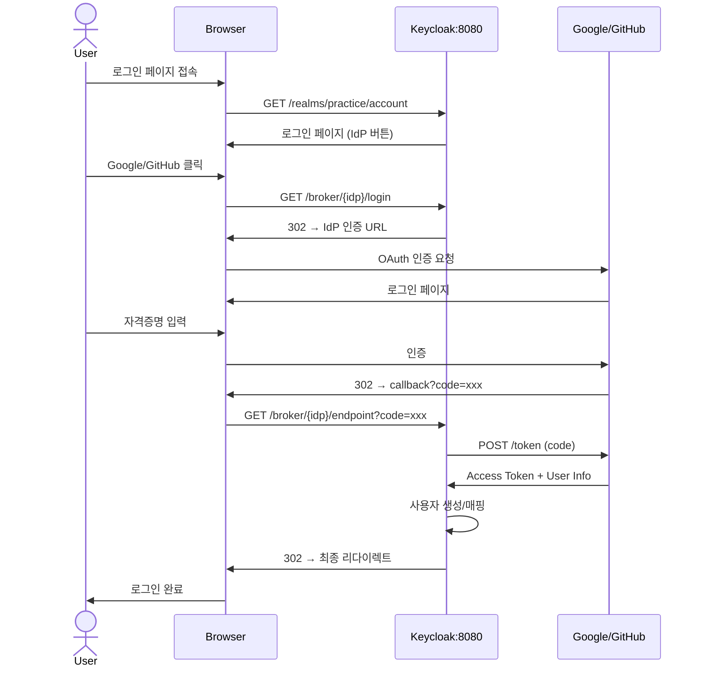

# SSO 연동

Keycloak Identity Provider로 Google, GitHub 연동

## 플로우



---

## Google 연동

### 1. Google Cloud Console 설정

1. [Google Cloud Console](https://console.cloud.google.com/) 접속
2. 프로젝트 생성/선택
3. APIs & Services → Credentials
4. Create Credentials → OAuth client ID
5. Application type: `Web application`
6. Authorized redirect URIs:
   ```
   http://localhost:8080/realms/practice/broker/google/endpoint
   ```
7. Client ID, Client Secret 복사

### 2. Keycloak 설정

1. Realm: `practice` 선택
2. Identity Providers → Add provider → `Google`
3. 설정:

| 항목 | 값 |
|------|-----|
| Client ID | Google에서 복사한 값 |
| Client Secret | Google에서 복사한 값 |

4. Save

---

## GitHub 연동

### 1. GitHub OAuth App 설정

1. GitHub → Settings → Developer settings → OAuth Apps
2. New OAuth App
3. 설정:

| 항목 | 값 |
|------|-----|
| Application name | `keycloak-practice` |
| Homepage URL | `http://localhost:8080` |
| Authorization callback URL | `http://localhost:8080/realms/practice/broker/github/endpoint` |

4. Client ID, Client Secret 복사

### 2. Keycloak 설정

1. Identity Providers → Add provider → `GitHub`
2. 설정:

| 항목 | 값 |
|------|-----|
| Client ID | GitHub에서 복사한 값 |
| Client Secret | GitHub에서 복사한 값 |

3. Save

---

## 테스트

1. http://localhost:8080/realms/practice/account 접속
2. Google 또는 GitHub 로그인 버튼 확인
3. 로그인 후 사용자 자동 생성 확인
